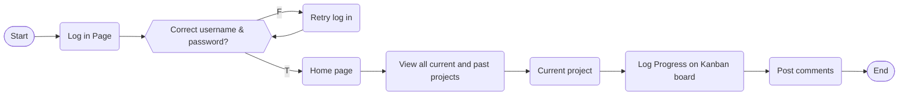
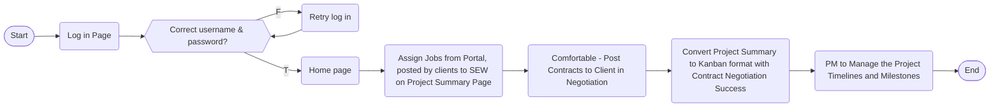

# Full-Stack Otter - Part-Time Software Engineering Project Management App

by Eric Foo, Zack (Zheng Jie) Quah and Graham James Lim

Full-Stack Otter is a software project management app designed to help programmers who already have full-time jobs side-hustle their spare time for paid, pre-qualified freelance coding jobs in their spare time.

## Context

Full-stack software engineers are always in demand by businesses, but not all business can hire a permanent full-stack team with the post-pandemic talent crunch.
Yet, software engineers who are already employed often look for opportunities outside of work hours to earn a side income. This app offers project-based work to a curated list of full-stack software engineers who register on the Full-Stack Otter, in a similar vein to platforms like Toptal or Fiverr.

However, the difference between this app and such platforms is that any work from clients here is managed by a project manager, end-to-end. Work pipeline is generated after an initial consulting session between the project manager and the client to not only take client requirements, but to manage expectations and timelines realistically. It is only after jobs are properly qualified by the project manager that they get posted onto the app's portal for the engineers to bid on.

Once the required number of engineers enrol in a project, the project manager kicks off development with a briefing call, before unlocking a kanban board for the engineers to use for progress to be tracked until completion and production (agile scrum). The clients do not interface with the engineers at all, which allows the engineers to focus strictly on development within their agreed parameters. At the same time, any changes in client expectations are triaged by the project manager first, before changes to project timelines or parameters are communicated to the engineers.

### User Flows

##### Enrol in New Project (Software Engineer)

##### View Job postings, Assign to SEW, and Manage Project (PM)

### Wireframes

[View Wireframes](https://drive.google.com/file/d/1QyYC_qbJ1NE1E3jB-R2nNixHOm2jg5Ef/view?usp=sharing)

### Database ERD

[View ERD](https://drive.google.com/file/d/1xN8Zs8Zy1Qrxm6BlVJpsW6zamGonTRF7/view?usp=sharing)
